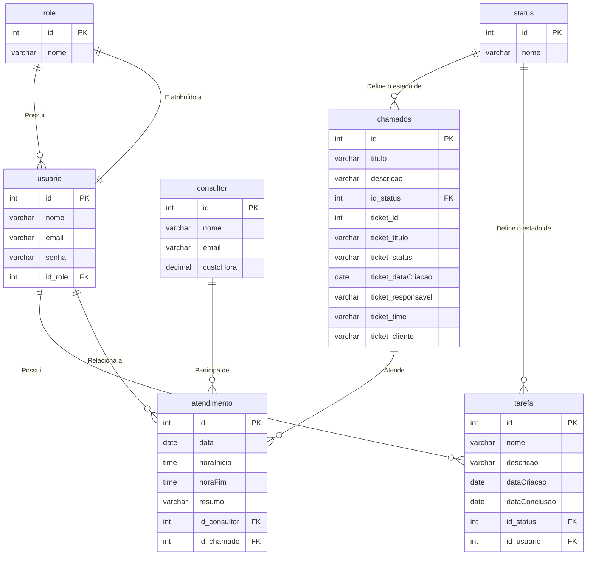

Realizai um projeto parecido com java, mas gostaria de aplicar com NodeJS e o frontEnd com React.

```mermaid
erDiagram
    role {
        int id PK
        varchar nome
    }
    
    usuario {
        int id PK
        varchar nome
        varchar email
        varchar senha
        int id_role FK
    }
    
    status {
        int id PK
        varchar nome
    }
    
    consultor {
        int id PK
        varchar nome
        varchar email
        decimal custoHora
    }
    
    chamados {
        int id PK
        varchar titulo
        varchar descricao
        int id_status FK
        int ticket_id
        varchar ticket_titulo
        varchar ticket_status
        date ticket_dataCriacao
        varchar ticket_responsavel
        varchar ticket_time
        varchar ticket_cliente
    }
    
    atendimento {
        int id PK
        date data
        time horaInicio
        time horaFim
        varchar resumo
        int id_consultor FK
        int id_chamado FK
    }
    
    tarefa {
        int id PK
        varchar nome
        varchar descricao
        date dataCriacao
        date dataConclusao
        int id_status FK
        int id_usuario FK
    }
    
    role ||--o{ usuario : "Possui"
    usuario ||--|| role : "É atribuído a"
    usuario ||--o{ tarefa : "Possui"
    status ||--o{ chamados : "Define o estado de"
    status ||--o{ tarefa : "Define o estado de"
    consultor ||--o{ atendimento : "Participa de"
    chamados ||--o{ atendimento : "Atende"
    usuario ||--o{ atendimento : "Relaciona a"
```
